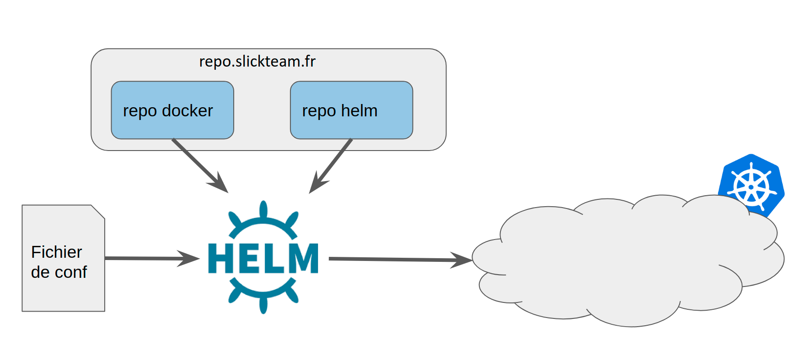

# Kubernetes Easy

## Constat

* Cluster kubernetes
* Exemples de déploiements avec gitlab-ci
* Configurations complexe :/
* trop complexe pour des projets simples
* Une configuration particulière par environnement :/

[Exemple] (https://code.slickteam.fr/geeking-days/SlicKDir/-/tree/master/kubernetes/CI)

## Objectifs 

* Simplifier des déploiements sur un cluster kubernetes
* Pour les applications simples
* Minimum de configuration
* Inspiration de docker-compose


## Ce qu’il peut gérer

* Deployements
  * pods
  * replicas
  * variable d’environnements
  * limites/resources
* Services
  * ClusterIP, NodePort
  * Ingress
  * fournir une “route” pour accéder à l’application
* Volume
  * de type local-path
* Différents environnements

## Exemple: Le nouveau site slickteam

```yaml
appName: newsite-nuxt
container:
  imageName: repo-intern.slickteam.fr/newsite-nuxt
  # Overrides the image tag whose default is the chart appVersion.
  imageTag: latest
  port: 3000

service:
  type: NodePort
  nodePort: 30100

imagePullSecrets: [name: "registrypullsecret"]

```

## Techno

* Helm
* Chart helm

## Pré-requis (en local)

* kubectl (?)
* helm
* ajouter le repo slickteam 

```bash
helm repo add slickteam "https://repo.slickteam.fr/repository/helm/" --username <slickteam_username> --password <slickteam_password>
helm repo update
```

## Utilisation

1. Écrire un fichier de déploiment 
  * Comme celui du site slickteam vu plus haut
1. Installer ou mettre-à-jour l'application

```bash
helm upgrade -i  <nom_application> slickteam/kubernetes-easy-template -f fichier_deploiment.yaml

```

## Dans gitlab

```yaml
deploy to cluster:
  stage: deploy
  image:
    name: alpine/helm
    entrypoint: ["/bin/sh", "-c"]
  before_script:
    - helm repo add slickteam "https://repo.slickteam.fr/repository/helm/" --username $NEXUS_USER  --password $NEXUS_PASSWORD
    - helm repo update
  script:
    - helm upgrade -i newsite-nuxt slickteam/kubernetes-easy-template -f kubernetes/deploy.yaml --set container.imageTag=$VERSION -n website
  environment:
    name: sandbox
    kubernetes:
      namespace: website

```

## Flow




## Resources

* [Repository gitlab](https://code.slickteam.fr/geeking-days/kubernetes-easy)
* [Exemple site vitrine](https://code.slickteam.fr/slicksi/vitrine/site-web-slickteam/newsite-nuxt/-/blob/develop/kubernetes/deploy.yaml)
* [Exemple Slickdir](https://code.slickteam.fr/geeking-days/SlicKDir/-/tree/master/kubernetes/easy)

## Remarques / questions